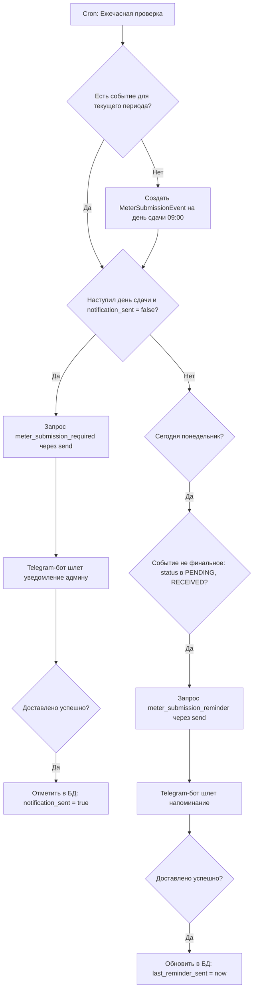

# Процесс: Контроль подачи показаний счетчиков (Meter Submission Event Flow)

Этот процесс автоматизирует контроль ежемесячной подачи показаний приборов учета (счетчиков) арендаторами по всем подключенным лицевым счетам. Бот отправляет уведомление администратору, требуя подтверждения, и напоминает раз в неделю по понедельникам, пока показания не будут переданы в службу или напоминания не будут принудительно завершены.

## Диаграмма процесса (Flowchart)

## Статусы события

Каждое событие `MeterSubmissionEvent` проходит следующие фазы (поле `status` в БД):
1. **`PENDING`** (⏳ Ожидает получения от арендатора). Начальное состояние.
2. **`RECEIVED`** (📩 Получены от арендатора (ожидают отправки)). Устанавливается после подтверждения получения показаний или ручного ввода конкретного значения (`readingsValue`). Напоминания по понедельникам продолжают приходить.
3. **Финальные состояния (останавливают напоминания)**:
   * **`SUBMITTED`** (✅ Переданы в службу). Указывает на то, что администратор ввел эти показания на сайте коммунальной службы.
   * **`COMPLETED_WITHOUT_SUBMISSION`** (❌ Завершено без передачи). Администратор принудительно заглушил напоминания для данного счета и периода.

---

## Детальная последовательность шагов

### 1. Инициализация и планирование (Accountant Service)
* Ежечасно срабатывает Cron-метод `handleMeterChecks` в `MeterEventService`.
* Метод вычисляет текущий период (например, `202607` для июля 2026 года) и проверяет наличие записи `MeterSubmissionEvent` для каждого `Account` в БД.
* Если записи нет, создается событие. Дата отправки (`targetDate`) рассчитывается индивидуально для каждого счета на основе поля `meterSubmissionDay` в таблице `Account` (по умолчанию `20`). Для предотвращения переноса даты на следующий месяц (например, 31 июня), день автоматически ограничивается (clamped) максимальным числом дней в текущем месяце. Время отправки устанавливается на **09:00:00**.

### 2. Отправка первого уведомления
* Если текущее время больше или равно `targetDate` и `notificationSent` в БД равен `false`:
  * Сервис Accountant отправляет запрос `meter_submission_required` в RabbitMQ с использованием шаблона Request-Response (`send`).
  * Telegram-бот принимает запрос, формирует сообщение со статусом события и адресом, и отправляет его администраторам.
  * Если отправка в Telegram успешна хотя бы для одного администратора, бот возвращает ответ `{ success: true }`.
  * При получении `{ success: true }` Accountant обновляет статус события в БД на `notificationSent = true`.
  * Сообщение содержит следующие inline-кнопки:
    * `✅ Получены` (callback: `admin_confirm_readings_received_${eventId}`)
    * `📥 Ввести показания` (callback: `admin_enter_readings_${eventId}`)
    * `❌ Завершить без передачи` (callback: `admin_complete_without_sub_${eventId}`)

### 3. Еженедельные напоминания по понедельникам
* Если сегодня понедельник, Accountant проверяет наличие событий, у которых:
  * `notificationSent = true`
  * `status` равен `PENDING` или `RECEIVED` (событие еще не перешло в финальный статус).
  * Событие относится к прошлой календарной неделе (`targetDate < начало текущей недели`).
  * Напоминание еще не отправлялось на этой неделе (`lastReminderSent` пуст или меньше начала текущей недели).
* При совпадении условий Accountant отправляет запрос `meter_submission_reminder` в RabbitMQ (также через Request-Response `send`).
* Бот доставляет повторное напоминание в Telegram и возвращает `{ success: true }`. При успешном ответе в Accountant обновляется поле `lastReminderSent = now`.

### 4. Интерактивные действия администратора

#### А. Подтверждение получения (без ввода числовых значений)
* Администратор нажимает кнопку `✅ Получены`.
* Бот отправляет запрос `mark_readings_received` в Accountant.
* Статус обновляется на `RECEIVED`, `receivedAt = now`.
* Сообщение обновляется в реальном времени. В клавиатуре появляются кнопки:
  * `📤 Отметить как переданные`
  * `📝 Ввести/Изменить показания`
  * `❌ Завершить без передачи`

#### Б. Ручной ввод показаний (сохранение в БД)
* Администратор нажимает кнопку `📥 Ввести показания` (или `📝 Изменить показания`).
* Бот устанавливает сессионное состояние `awaiting_meter_readings` и просит ввести данные текстовым сообщением.
* Администратор отправляет сообщение (например, `254.3 м³`).
* Бот перехватывает сообщение, отправляет RPC-запрос `submit_meter_readings_value` в Accountant.
* Значение сохраняется в поле `readingsValue`, а статус переводится в `RECEIVED`.
* Исходное интерактивное сообщение обновляется в чате, отображая введенные показания и предлагая кнопки дальнейших действий (`📤 Отметить как переданные`, `📝 Изменить показания`, `❌ Завершить без передачи`).

#### В. Финализация: Передано в службу
* Администратор нажимает `📤 Отметить как переданные`.
* Бот отправляет запрос `submit_meter_readings` в Accountant.
* В БД проставляется `status = 'SUBMITTED'` и `submittedAt = now`.
* Бот редактирует сообщение, удаляя все кнопки и переводя статус в `✅ Переданы в службу`.

#### Г. Финализация: Завершить без передачи
* Администратор нажимает `❌ Завершить без передачи`.
* Бот отправляет запрос `complete_without_submission` в Accountant.
* В БД проставляется `status = 'COMPLETED_WITHOUT_SUBMISSION'`.
* Бот редактирует сообщение, удаляя кнопки и переводя статус в `❌ Завершено без передачи`. Напоминания прекращаются.
